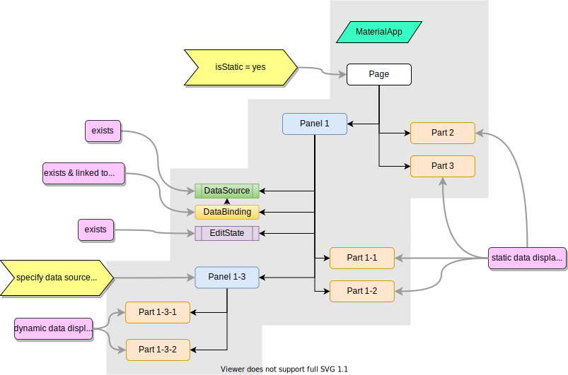

# Kitchen Sink

This is a Precept model which attempts cover every permutation of build options available through [PScript](../../user-guide/precept-script.md) and [PSchema](../../../user-guide/precept-schema.md).

All widget tests and functional tests are run against the 'kitchen sink', defined by a  `PScript` and `PSchema`.

There are diagrams describing different test [scenarios](#scenarios), with an associated test file.

Every diagram uses the conventions shown in the [legend](#legend).

## Data Schema

This is used to exercise as many features of Precept as we can think of.  

It probably does not reflect a real app!

The terminology here is that of the `PSchema` structure - primarily it is documents and fields.

How it is interpreted for the target 'database' depends on the `BackendDelegate` in use.  That depends on the **backendType** property of `PDataProvider`.

### Account Document

| Column           | PField Type     | Validation                                        | Read Permissions | Write permissions |
|------------------|-----------------|---------------------------------------------------|------------------|-------------------|
| id               | PString         | none                                              | customer, admin  | admin             |
| recordDate       | PDate           | none                                              | customer, admin  | system            |
| customer         | PDocument       | required                                          | customer, admin  | customer          |
| address          | PPointer        | only one target                                   | customer, admin  | customer          |
| notifications*   | PSelectBoolean  | offers can only be true >= 30 days after joinDate | customer, admin  | customer          |
| linkedAccounts   | PPointer        |                                                   | customer, admin  | customer, admin   |
| joinDate         | PDate           | required, later or equal to recordDate            | customer, admin  | admin             |
| average          | PDouble         | >0                                                | admin            | admin             |
| colourChoices**  | PSelectString   |>= 3, <=6 choices, all different, hex String       | customer, admin  | customer          |
| successRate      | PDouble         | 0-1 inclusive (displayed as %)                    | admin            | admin             |

- \* notifications options: offers, changes, events:
- ** colourChoices: any selected by user, hex String 

### Person Document

| Column    | PField Type | Validation | Read Permissions | Write permissions |
|-----------|------------|------------|------------------|-------------------|
| firstName | PString    | required   | customer, admin  | customer          |
| lastName  | PString    | required   | customer, admin  | customer          |
| age       | PInteger   | >=18       | customer, admin  | customer          |

### Address Document

| Column     | PField Type       | Validation                 | Read Permissions | Write permissions |
|------------|------------------|----------------------------|------------------|-------------------|
| firstLine  | PString          | min 2 characters           | customer, admin  | customer          |
| secondLine | PString          | min 3 characters           | customer, admin  | customer          |
| postCode   | PString          | valid for selected country | customer, admin  | customer          |
| country    | PSelectString    |                            | customer, admin  | customer          |
| location   | PPosition        |                            | customer, admin  | customer          |
| region     | PGeoRegion       |                            | customer         | system            |
 
## Legend

The diagram below depicts the conventions used on all 'kitchen sink' diagrams.

:::warning

The following is out of date and should be ignored

:::

 

## Scenarios

### Static Page

The entire page is static, so there are no links to data, or any need for editing.

### Static Page with Overrides

The Page is static, but some lower levels are overridden to be dynamic.

 

### Page Controls Edit with Overrides

Edit controls (usually a :pencil:) only appear at the level specified in the `PScript`.

This is set by the **controlEdit** property, which also causes an `EditState` to be added to the Widget tree.

Everything below that `EditState` responds to that state, and ignores changes to `EditState` instances further up the tree.

 