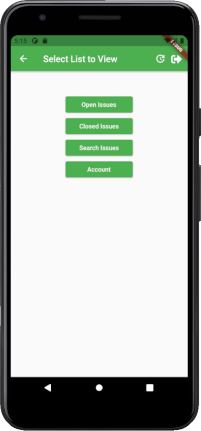

# Tutorial

Provides a step by step guide to building the Precept sample app but does not give much in the way
of explanation. If you want more information, see the [detailed version](tutorial-explanation.md)

:::caution

**Early Stage Development**

Precept is at Proof of Concept stage, and it has bugs and missing functionality. It is hoped that
this tutorial and accompanying video will generate enough interest to push the project forward even faster to remedy these limitations.
:::

## Assumptions

You are using Android Studio (with apologies to anyone using a different IDE).

## Prior knowledge

It would be helpful but not essential to have some knowledge of:

- Flutter
- GraphQL
- Back4App 


## Create a Flutter App

In Android Studio, 

- File | New | New Flutter Project
- Select 'Flutter' on the left
- Next
- enter 'myapp' as the project name
- Finish


This will provide a copy of the default sample Flutter application, which we will modify later.

:arrow_forward: Run the app

:white_check_mark:  Make sure it works.

## Prepare Server

- Follow the steps to [prepare back4app](prepare-back4app.md).  

- Note the App Id and Client Key from the Back4App instance you have just created.  (Server settings | Core Settings)  


## Set up Precept on Client

### Create precept.json

- Create an [application configuration file](../user-guide/app-configuration.md), *precept.json* in the project root.
- Copy the App Id and Client Key from your Back4App instance, and place into the JSON structure below.


```json
{
  "main": {
    "type": "back4app",
    "dev": {
      "headers": {
        "X-Parse-Application-Id": "your App Id",
        "X-Parse-Client-Key": "Your Client Key"
      }
    }
  }
}
```

- Add *precept.json* to .gitignore (We do not want to commit keys to the repository)

### Precept dependencies

- in pubspec.yaml, add dependencies:

```yaml
  precept_client:
    path: ../precept_client
  precept_script:
    path: ../precept_script
  precept_backend:
    path: ../precept_backend
  precept_back4app_client:
    path: ../precept_back4app_client
```

- in pubspec.yaml, replace:

```yaml
  # assets:
  #   - images/a_dot_burr.jpeg
  #   - images/a_dot_ham.jpeg
```

with:
```yaml
  assets:
    - precept.json
```

- Run 'pub get'


## Step 01 - Hello World

- delete the test file *widget_test.dart*
- create a file *lib/app/config/precept.dart* containing:

```dart
import 'package:precept_script/common/script/common.dart';
import 'package:precept_script/schema/schema.dart';
import 'package:precept_script/script/script.dart';
import 'package:precept_script/part/text.dart';
import 'package:precept_script/script/version.dart';

final myScript = PScript(
  name: 'Tutorial',
  version: const PVersion(number: 0),
  routes: {
    '/': PPage(
      title: 'Home Page',
      content: [
        PText(
          readTraitName: PText.title,
          isStatic: IsStatic.yes,
          staticData: 'Precept',
        ),
      ],
    ),
  },
  schema: PSchema(
    name: 'Tutorial Schema',
    version: const PVersion(number: 0),
  ),
);

```
This script is what will define our application.

<details>
  <summary>Explanation</summary>
  <div>
    <div>Our first page will have purely static data, so we do not need a schema yet</div>
  </div>
</details>

- In *main.dart*, leave `MyHomePage` as it is but replace the `main()` method and `MyApp` with:

```dart
import 'package:flutter/material.dart';
import 'package:precept_client/app/app.dart';
import 'package:precept_client/app/loader.dart';
import 'package:precept_client/app/precept.dart';
import 'package:precept_tutorial/app/config/precept.dart';

void main() async {
  await precept.init(
    loaders: [
      DirectPreceptLoader(script: myScript),
    ],
  );
  final ThemeData theme = ThemeData(
    primarySwatch: Colors.green,
    visualDensity: VisualDensity.adaptivePlatformDensity,
  );
  runApp(PreceptApp(theme: theme));
}

```


:arrow_forward:

:white_check_mark:  It should look like this:


<details>
  <summary>Explanation</summary>
  <div>
    <div>These are the details</div>
  </div>
</details>

[detail](tutorial-explanation.md#step-01---hello-world)

## Step 02 - Styling text

- Update *precept.dart* to show text element with different traits, and add a `PNavButton`

```dart {18-32}
import 'package:precept_script/common/script/common.dart';
import 'package:precept_script/script/script.dart';
import 'package:precept_script/part/text.dart';
import 'package:precept_script/part/navigation.dart';


final myScript = PScript(
  name: 'Tutorial',
  routes: {
    '/': PPage(
      title: 'Home Page',
      content: [
        PText(
          readTraitName: PText.title,
          isStatic: IsStatic.yes,
          staticData: 'Precept',
        ),
        PText(
          readTraitName: PText.subtitle,
          isStatic: IsStatic.yes,
          staticData: 'Proof of Concept',
        ),
        PText(
          readTraitName: PText.strapText,
          isStatic: IsStatic.yes,
          staticData: 'A brief introduction to faster Flutter development',
        ),
        PNavButton(
          isStatic: IsStatic.yes,
          staticData: 'OK',
          route: 'chooseList',
        ),
      ],
    ),
  },
);
```

:arrow_forward:

:white_check_mark:  It should look like this:


:white_check_mark: Tapping the 'OK' button will go to error page, as the 'chooseList' route is not
yet defined.

## Step 03 - Navigation Page

A simple page construct for users to choose where to go.

Route 'chooseList' added, with `PNavButtonSet` providing list of routes for user to select.

- Update *precept.dart* to:

```dart {35-48}
import 'package:precept_script/common/script/common.dart';
import 'package:precept_script/common/script/layout.dart';
import 'package:precept_script/part/navigation.dart';
import 'package:precept_script/part/text.dart';
import 'package:precept_script/script/script.dart';

final myScript = PScript(
  name: 'Tutorial',
  routes: {
    '/': PPage(
      title: 'Home Page',
      content: [
        PText(
          readTraitName: PText.title,
          isStatic: IsStatic.yes,
          staticData: 'Precept',
        ),
        PText(
          readTraitName: PText.subtitle,
          isStatic: IsStatic.yes,
          staticData: 'Proof of Concept',
        ),
        PText(
          readTraitName: PText.strapText,
          isStatic: IsStatic.yes,
          staticData: 'A brief introduction to faster Flutter development',
        ),
        PNavButton(
          isStatic: IsStatic.yes,
          staticData: 'OK',
          route: 'chooseList',
        ),
      ],
    ),
    'chooseList': PPage(
      layout: PPageLayout(margins: PMargins(top: 50)),
      title: 'Select List to View',
      content: [
        PNavButtonSet(
          buttons: {
            'Open Issues': 'openIssues',
            'Closed Issues': 'closedIssues',
            'Search Issues': 'search',
            'Account': 'account',
          },
        ),
      ],
    ),
  },
);
```

:arrow_forward:

- tap OK.

:white_check_mark: It should look like this:



- tap 'Open Issues'. It will fail because the 'openIssues' route is not defined. All the buttons
  will fail for this reason.

## Step 04 - Creating Database

We need a backend now to demonstrate data retrieval.

We will use Precept to generate the Back4App schema and populate some test data.

[:point_right:](tutorial-explanation.md#step-04---page-with-query)

### Create Back4App instance

- Create a [Back4app](https://www.back4app.com/) instance
- Note the application and client keys

### Generate Back4App schema

### Populate test data

### Set up Precept to display data

We need a Precept `PDataProvider` to support the query, and an 'openIssues' route to display it.

- Update *precept.dart* to be:

<<< docs/tutorial/step04/precept.dart{16-22,63-84}

- Install the **precept_back4app** package:

?????????

- Update *main.dart* to register Back4App **before** precept.init

<<< docs/tutorial/step04/main.dart{9-9}

- Create a schema for this `DataProvider`, at *lib/app/config/schema.dart*:

<<< docs/tutorial/step04/schema.dart

- Create the query in at *lib/app/query/issue.dart*:

<<< docs/tutorial/step04/issue.dart

- Update *precept.json* with the keys from your Back4App instance:

<<< docs/tutorial/step04/precept.json

:arrow_forward:

- tap OK.
- tap 'Open Issues'.

:white_check_mark: This will fail again, but this time because it will be looking for the 'signin'
route, which we have not yet defined.

## Step 05 - Authentication and Permissions

- Update *precept.dart* to:

[](tutorial-explanation.md#step-04---page-with-query)
