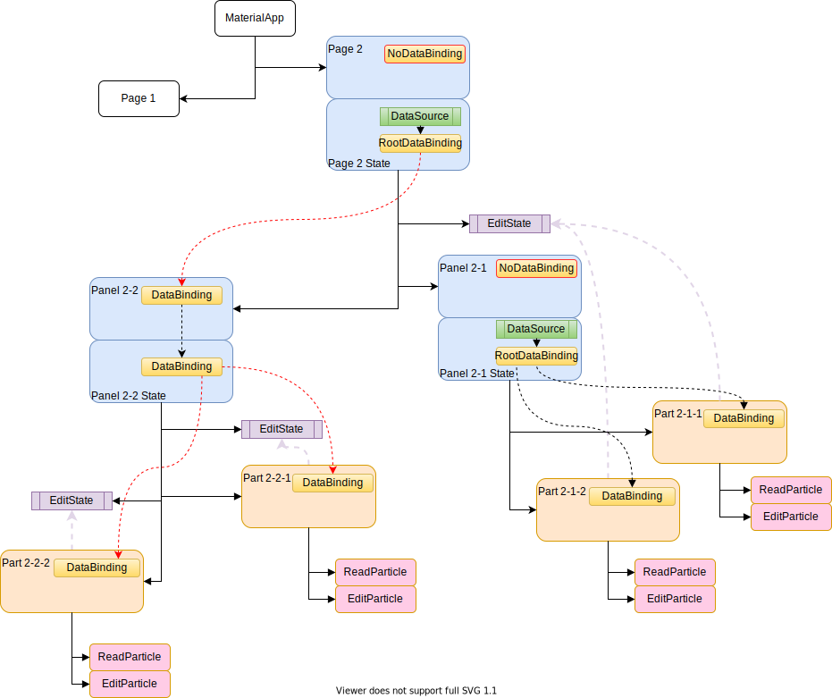

# Widget Tree

Precept naturally follows the Widget tree structure Flutter uses. It also uses the [Provider](https://pub.dev/packages/provider) package to manage some shared state.

The diagram below gives an illustration of a couple of scenarios of how the configuration of a [PScript](./precept-script.md) affects the Widget tree content.

We'll look at how Precept uses the Widget tree from two perspectives:
 
- the presentation (`PScript`) part, 
- the data / schema / validation aspect (`PSchema`)

## Presentation

The structure of the presentational aspect of the Widget tree follows the structure of `PScript`.
  
`PPage`, `PPanel`, `PPart` and `PParticle` become instances of `PreceptPage`, `Panel`, `Part` and `Particle` respectively, shown in the [diagram](#diagram) below.

`PreceptPage`, `Panel`, `Part` and `Particle` are known as 'Content' widgets.

The page is built using the `PreceptRouter`, responding to the route defined in the `PRoute` containing the `PPage`.

The page content is built as Panels or Parts as defined by the `PScript`, with Panels being nestable.

The rest of the build just occurs through the normal Flutter Widget **build** method.

A `ContentBuilder` mixin is used because many of the build methods required are the same across all the 'Content' widgets.

Note that with the exception of `Particle`, all the 'Content' widgets are stateful - the reason for this is covered in the [Data](#data) section.

There is currently only one type of Page, Panel and Part, although that may change.

Particle types are looked up from the `ParticleLibrary`, which also allows you to [register](./libraries.md#registering-with-a-library) your own Particle implementations.

## Data

Note that `PreceptPage`, `Panel` and `Part` are stateful, and known as collectively as 'Content'.

### Getting the Data

Looking at Page 2 in the [diagram](#diagram) below, you will see it has a `DataBinding` in the Widget.

This is always a `NoDataBinding` in a page, and actually superfluous except for maintaining the same structure as Panels and Parts.

The Page state, however, contains a `Query` and another `DataBinding`.  

This is created in response to a `PQuery` being declared in the associated `PPage`. 

The `PQuery` defines how to retrieve data from its associated backend, defined by `PDataProvider` - essentially it is a query.

`Query` copies this data into a `TemporaryDocument`, so that the data can be edited if required, and returns an appropriate `FutureBuilder` or `StreamBuilder`.

While waiting for data to arrive, `Query` returns a 'waiting' widget to return, or throws exceptions in the event of failure.

A `RootDataBinding`, which is connected to the `TemporaryDocument`, is created alongside the `Query`.

Data then flows down through the tree - each Content widget holds a 'parentBinding' in its widget, and then creates a child binding in its state, using the property specificed in the relevant element of the `PScript`.  

Thus, data is connected from the `Query` through a chain of `DataBinding` instances, until it reaches a `Part`.

### Displaying the Data

A `Part` widget also contains a **parentBinding**, but does not create a child binding in its `PartState`.

Instead, it spawns a read or edit `Particle` as required, using the `ParticleLibrary`.

As part of that process a connector is created which transfers the data to / from the **parentBinding** to the Particle widget, converting the data type if necessary.

This process actually happens in the `ParticleLibrary`, as this is where the `Particle` is instantiated.

### Edit or Read

Referring again to the [diagram](#diagram), you will see an `EditState` placed above 'Panel 2-1', 'Part 2-2-1' and 'Part 2-2-2'. 

These are positioned by the [inherited property](./precept-script.md#inherited-properties) **controlEdit**, which provides a flexible way to define which Content elements can change the current edit status.

A `Part` finds the nearest `EditState` above it to determine which Particle to use.

From the diagram, you can see that 'Part 2-2-1' and 'Part 2-2-2' have their own `EditState` immediately above them - so each of them controls its own edit state.

'Panel 2-1', however, has an `EditState` which is used by itself, and its Parts.  'Part 2-1-1' and 'Part 2-1-2' will therefore both respond to changes in their parent Panel's `EditState`.

This approach means you can control where the end user controls editing - from each individual Part to the whole Page.   
 

## Diagram

 